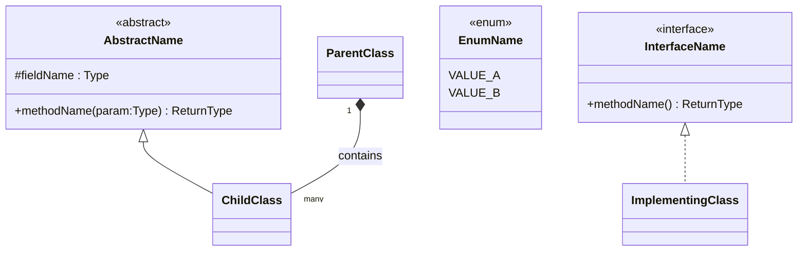
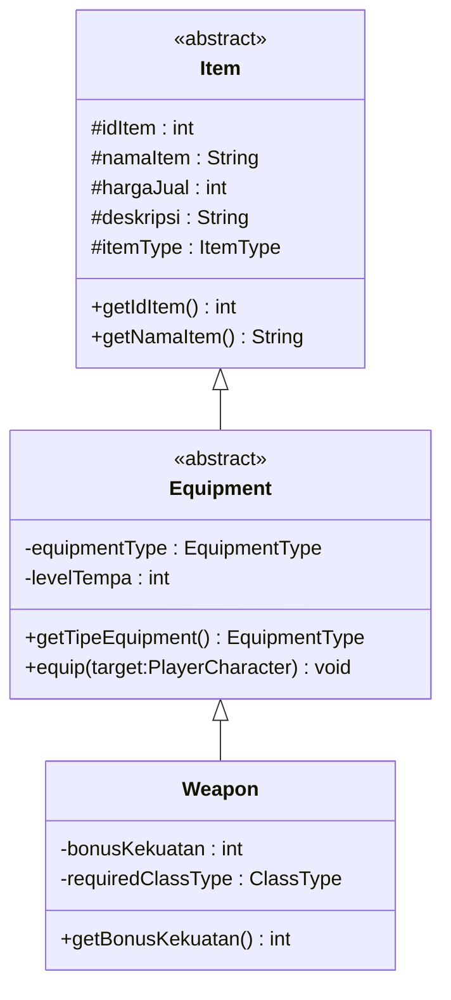

# PROMPT UNTUK GEMINI — Pembuat Mermaid Class Diagram Draw.io

Salin dan tempel prompt ini ke Gemini, lalu gunakan output Mermaid yang dihasilkan ke **Draw.io → menu Arrange → Insert → Advanced → Mermaid**.

---

## PROMPT (Copy-Paste ke Gemini)

```
Kamu adalah generator diagram UML yang sangat teliti. Tugas kamu: membaca SELURUH file .java di direktori `src/` dan menghasilkan SATU blok kode Mermaid `classDiagram` yang LENGKAP dan KOMPATIBEL dengan draw.io (app.diagrams.net).

# ATURAN OUTPUT
- Output HANYA berupa SATU blok kode Mermaid dalam ```mermaid ... ```
- Jangan tambahkan penjelasan, heading, atau teks di luar blok kode.
- Gunakan topDirection TB (top-to-bottom) atau LR sesuai kebutuhan agar tidak menumpuk.
- Sintaks HARUS 100% valid Mermaid classDiagram dan bisa di-render tanpa error di draw.io.

# INSTRUKSI SCAN
1. Baca SEMUA file .java yang ada di `src/` (sekitar 50+ file) beserta semua subfoldernya:
   - enums/  (BattleResult, ClassType, EquipmentType, ItemType, StatusLokasi, StatusQuest)
   - main/   (App, Main, AnsiColors)
   - minigames/ (GiziGame, MiniGame, Quiz, QuizGame)
   - models/account/ (AccountProfile)
   - models/character/ (BossMonster, GameCharacter, Monster, PlayerCharacter, Skill)
   - models/item/ (Accessory, Armor, ConsumableFood, Equipment, IConsumable, IEquippable, Ingredients, Item, Weapon)
   - models/location/ (Location)
   - models/quest/ (MainQuest, Quest, SubQuest)
   - systems/battle/ (AdventureSystem, BattleEnemyFactory, BattleLog, BattleSystem)
   - systems/classSystem/ (ClassNode, ClassSystem)
   - systems/craft/ (CraftingSystem, ForgeSystem)
   - systems/encyclopedia/ (Encyclopedia)
   - systems/gacha/ (GachaSystem, itemGacha)
   - systems/inventory/ (Inventory)
   - systems/map/ (MapTraversal, WaypointSystem)
   - systems/music/ (MusicPlayer)
   - systems/quest/ (QuestTracker)
   - systems/save/ (SaveLoadSystem)
   - systems/shop/ (Shop)
   - systems/skill/ (SkillNode, SkillSystem)
   - systems/vault/ (Vault)
   - DummyData/* (jika relevan untuk dependensi)
2. Untuk SETIAP class/interface/enum, daftarkan:
   - Nama, modifier (`+` public, `-` private, `#` protected, `~` package-private)
   - `<<interface>>`, `<<abstract>>`, `<<enum>>` bila relevan
   - extends parent (jika ada) — gunakan `Class <|-- ChildClass`
   - implements interface (jika ada) — gunakan `Interface <|.. Class`
3. Untuk SETIAP atribut, cantumkan:
   - Visibilitas
   - Tipe (termasuk generic seperti `List<Item>`, `HashMap<Integer, Item>`)
   - Nama
   - Tandai `static` dengan `{static}` dan `final` dengan `{final}` (contoh: `+MAX_SIZE : int` lalu catatan jika perlu)
4. Untuk SETIAP method, cantumkan:
   - Visibilitas
   - Tipe return (void, int, String, List, dst)
   - Nama method + parameter (nama + tipe, tanpa isi)
   - Tandai `static` dengan `{static}` bila ada
   - Tandai `abstract` dengan `{abstract}` bila ada
5. Cantumkan KEDUA constructor yang overload bila ada (hanya signature).
6. JANGAN lewatkan getter/setter — meskipun sederhana, tetap daftarkan (class diagram lengkap = lengkap).

# RELASI YANG HARUS DICANTUMKAN (WAJIB)
- **Inheritance**: `<|--` (extends)
- **Realization/Implementation**: `<|..` (implements)
- **Composition** (field berisi instance, lifetime sama): `*--`
- **Aggregation** (field berisi instance, lifetime independen): `o--`
- **Association** (digunakan di method signature/return, atau field weak): `-->`
- **Dependency** (sangat longgar, parameter/local var): `..>`
- Labeli setiap relasi dengan multiplicity (1, 0..1, 1..*, dst) dan nama field bila perlu.
  Contoh: `PlayerCharacter "1" o-- "0..3" Equipment : equips`

# SYNTAX TEMPLATE YANG HARUS DIIKUTI


# CONTOH SPESIFIK DARI PROJECT INI (referensi gaya, bukan salin)


# LARANGAN
- Jangan gunakan keyword Java seperti `String[]`, `int[]` langsung — tulis `String~Array~` atau `List~String~` (Mermaid generic syntax).
- Jangan buat diagram terpotong. SELESAIKAN satu class dalam satu blok definisi.
- Jangan gunakan `<`, `>`, `(`, `)` di nama tipe tanpa escaping.
- Jangan buat asumsi — jika ragu tentang relasi, gunakan association `-->`, jangan dikosongkan.
- Jika terdapat koleksi, tunjukkan relasi ke class elemen, bukan ke Collection generic.

# TUGAS FINAL
Hasilkanlah class diagram Mermaid yang LENGKAP dengan:
✓ Semua class (interface, abstract, enum, concrete) dari src/
✓ Semua atribut dengan modifier dan tipe
✓ Semua method (termasuk getter/setter)
✓ Semua relasi (extends, implements, composition, aggregation, association)
✓ Label multiplicity yang masuk akal (1, 0..1, *, 0..*, dst)
✓ Kompatibel penuh dengan draw.io Mermaid renderer

Mulai sekarang. Output HANYA blok kode ```mermaid ... ``` dan tidak ada teks lain.
```

---

## Cara Pakai

1. Buka Gemini (https://gemini.google.com)
2. Tempel prompt di atas
3. Gemini akan scan semua file di `src/` (pastikan folder sudah ter-upload atau path-nya sesuai)
4. Copy seluruh blok `mermaid` dari output Gemini
5. Buka **draw.io** → **Arrange → Insert → Advanced → Mermaid**
6. Paste → klik **Insert**
7. Draw.io akan otomatis render class diagram

> **Catatan**: Jika Gemini tidak otomatis scan folder, tambahkan konteks: *"Berikut struktur folder project: [tempelkan output `tree src/` atau copy-paste isi semua file .java] — sekarang buat class diagramnya."*
